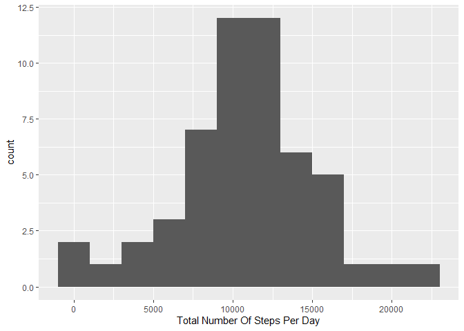
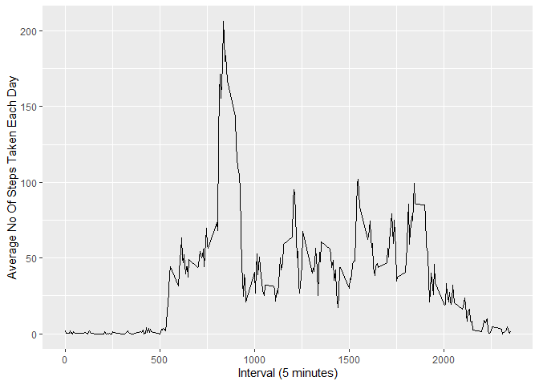
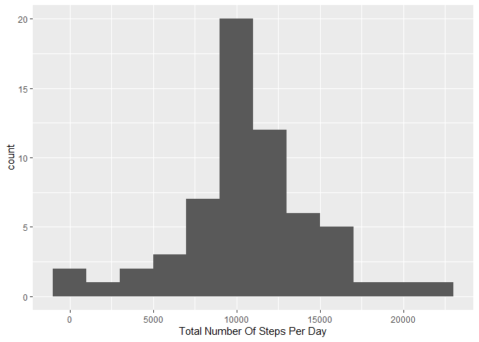
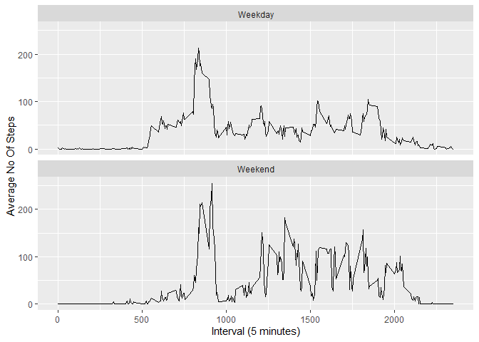

## Loading and preprocessing the data
#### Required libraries are loaded and the activity dataset is read and first few rows are displayed

```r
##Loading libraries

library(dplyr)
```

```
## Warning: package 'dplyr' was built under R version 4.0.2
```

```
## 
## Attaching package: 'dplyr'
```

```
## The following objects are masked from 'package:stats':
## 
##     filter, lag
```

```
## The following objects are masked from 'package:base':
## 
##     intersect, setdiff, setequal, union
```

```r
library(ggplot2)
```

```
## Warning: package 'ggplot2' was built under R version 4.0.3
```

```r
## read the activity data file 
activitydata <- read.csv("activity.csv")
head(activitydata)
```

```
##   steps       date interval
## 1    NA 2012-10-01        0
## 2    NA 2012-10-01        5
## 3    NA 2012-10-01       10
## 4    NA 2012-10-01       15
## 5    NA 2012-10-01       20
## 6    NA 2012-10-01       25
```


## What is mean total number of steps taken per day?
#### Total number of steps is calculated for each day and plotted the histogram
#### Mean and median is calculated

```r
##Calculate total number of steps per day
totStepsPerDay <- aggregate(steps ~ date, data = activitydata, sum)

##Plot histogram

g <- ggplot(totStepsPerDay, aes(x = steps)) + geom_histogram(binwidth = 2000)
g <- g + xlab("Total Number Of Steps Per Day")
print(g)
```

<!-- -->

```r
## calculate mean and median total number of steps taken per day

stepMeanValue <- mean(totStepsPerDay$steps, na.rm = TRUE)
stepMedianValue <- median(totStepsPerDay$steps, na.rm = TRUE)
print(stepMeanValue)
```

```
## [1] 10766.19
```

```r
print(stepMedianValue)
```

```
## [1] 10765
```
#### The above shown is the mean and median values of total number of steps taken each day respectively.


## What is the average daily activity pattern?


```r
## calculate average daily activity pattern

avgNoOfStepsTaken <- aggregate(steps ~ interval, data = activitydata, mean)

gavgplot <- ggplot(avgNoOfStepsTaken, aes(x = interval, y = steps))
gavgplot <- gavgplot + geom_line() + xlab("Interval (5 minutes)") +
            ylab("Average No Of Steps Taken Each Day")
    

print(gavgplot)
```

<!-- -->

```r
##which 5 min interval has maximum number of steps
maxInterval <- avgNoOfStepsTaken[which.max(avgNoOfStepsTaken$steps),]$interval
print(maxInterval)
```

```
## [1] 835
```
#### the interval 835 has the maximum number of steps


## Imputing missing values
#### First total number of missing values are calulated and the missing values are imputed with mean value. we get the new imputed dataset without any missing values and following plot is made.

```r
## calculate the missing values and imputing with mean
totalnas <- sum(!complete.cases(activitydata))
print(totalnas)
```

```
## [1] 2304
```

```r
#impute the steps value
stepsImputed <- avgNoOfStepsTaken$steps[match(activitydata$interval, avgNoOfStepsTaken$interval)]

#impute the dataset

activitydataImputed <- transform(activitydata,
                                   steps = ifelse(is.na(activitydata$steps),
                                                  yes = stepsImputed,
                                                  no = activitydata$steps))

##total number of steps taken each day using imputed dataset
impuTotalNoOfStepsPerDay <- aggregate(steps ~ date , data = activitydataImputed, sum)

##plot histogram with imputed dataset

g <- ggplot(impuTotalNoOfStepsPerDay, aes(x = steps)) + geom_histogram(binwidth = 2000)
g <- g + xlab("Total Number Of Steps Per Day")
print(g)
```

<!-- -->

```r
#calculate the mean and median of imputed dataset
imputedStepMeanValue <- mean(impuTotalNoOfStepsPerDay$steps)
imputedStepMedianValue <- median(impuTotalNoOfStepsPerDay$steps)
print(imputedStepMeanValue)
```

```
## [1] 10766.19
```

```r
print(imputedStepMedianValue)
```

```
## [1] 10766.19
```


## Are there differences in activity patterns between weekdays and weekends?

```r
#average number of steps taken in weekday and weekend calculation


activitydataImputed$date <- as.Date(strptime(activitydataImputed$date, format = "%Y-%m-%d")) 

activitydataImputed <- activitydataImputed %>%
                      mutate(activitydataImputed,
                               weekdayorweekend = ifelse(weekdays(date) %in% 
                                                   c("Sunday", "Monday", "Tuesday", "Wednesday", "Thursday","Friday"), "Weekday", "Weekend")) %>%
                      group_by(weekdayorweekend)

avgstepsperweektype <- aggregate(steps~interval + weekdayorweekend, data = activitydataImputed, mean)                                   

weekplot <- ggplot(avgstepsperweektype, aes(x = interval, y = steps))
weekplot <- weekplot + geom_line() + xlab("Interval (5 minutes)") +
  ylab("Average No Of Steps") +
  facet_wrap(~weekdayorweekend, nrow = 2)


print(weekplot)
```

<!-- -->
#### It is evident that the activity pattern is higher on weekends comparing to the weekday.
